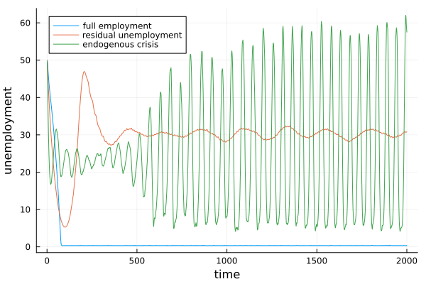

# Mark0.jl

A Julia implementation of the Mark0 model without a central bank.Bbased on the original C++ code avaiable at [Mark0 C++ (GitLab)](https://gitlab.com/sharma.dhruv/markovid).

```julia
    using Pkg
    Pkg.add(url="https://github.com/Devetak/Mark0.jl")
```


Usage to replicate the Mark0 phase transition.

```julia
using Mark0
using Plots

par = getParameters()
u1 = mark0_noCB(par, 2000, 41, 2000) # full employment
par[1] = 0.02
u2 = mark0_noCB(par, 2000, 41, 2000) # residual unemployment
par[1] = 0.08
par[2] = 5.0
u3 = mark0_noCB(par, 2000, 41, 2000) # endogenous crises
plot(100 * u1, label="full employment")
plot!(100 * u2, label="residual unemployment")
plot!(100 * u3, label="endogenous crisis")
xlabel!("time")
ylabel!("unemployment")
```


